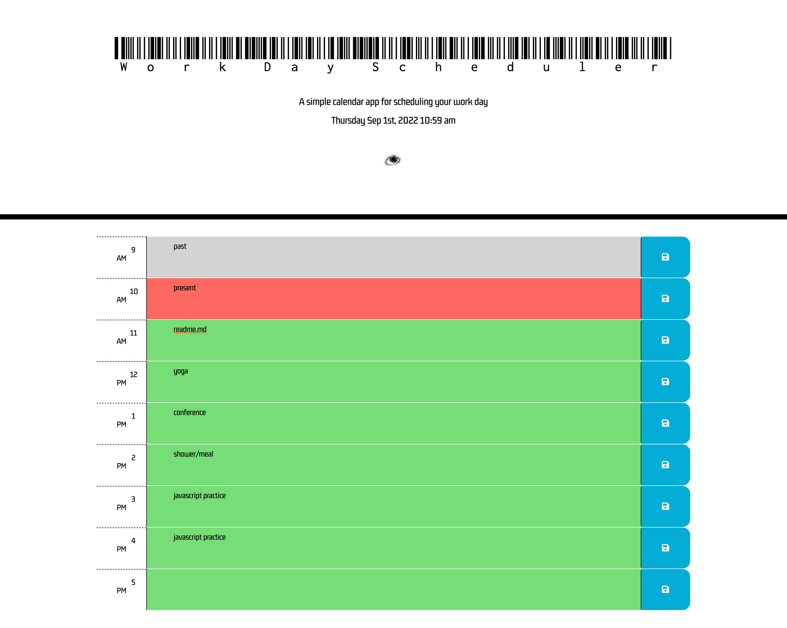

# [WorkDay]

So this is my WorkDay Scheduler program :man_dancing:

Here is what the program looks like when you open it :alarm_clock:



## How to Use 

So you must clone this repository as a zip or directly through terminal 

Once you have downloaded the project then direct it where you stored the file and run:

```
code ..

```
## Functionality 

It is a pretty sraightforward application !! 
I used Moment JS/jquery/parse/localstorage to get things working properly  :dna: 

As far as UI properties the colorcodes will let you know availability 

past is :white_large_square:

current is :red_square: 

future is :green_square: 


You use the save button to save your information to local storage :high_brightness: 


## Deployment Link 

If you'd like to use the deployment link instead of the files you can :innocent: 

Link: 